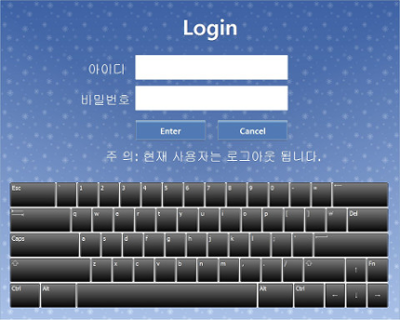
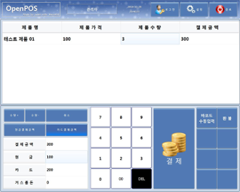
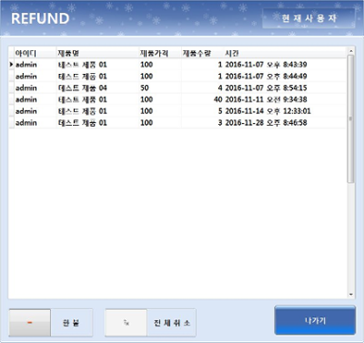
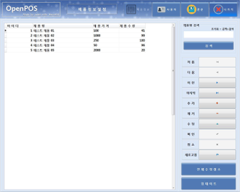

# OpenPOS

## Overview
소매 상점을 위해 개발된 공개형 POS 프로그램입니다. 

## Preview

## OpenPOS Info
개발 환경: Embarcadero XE2 C++ Builder

사용한 DBMS: MySQL 5.7, (compatibled MariaDB)

호환 운영체제: Microsoft Windows XP, Vista, 7 (Embedded Edition, 64bit 운영체제 포함)

## Warning

이 소스 코드에는 오직 OpenPOS 프로그램에 대한 소스 코드만 담겨져 있으며, 디자인 라이브러리 및 주요 헤더 파일은 저작권 등의 문제로 공개하지 않습니다.

반드시 정해진 개발 환경에서 빌드하는 것을 권장합니다.

(This source code contains only the proprietary source of OpenPOS software and excludes header files and libraries.

Be sure to use it only with certain development tools.)
